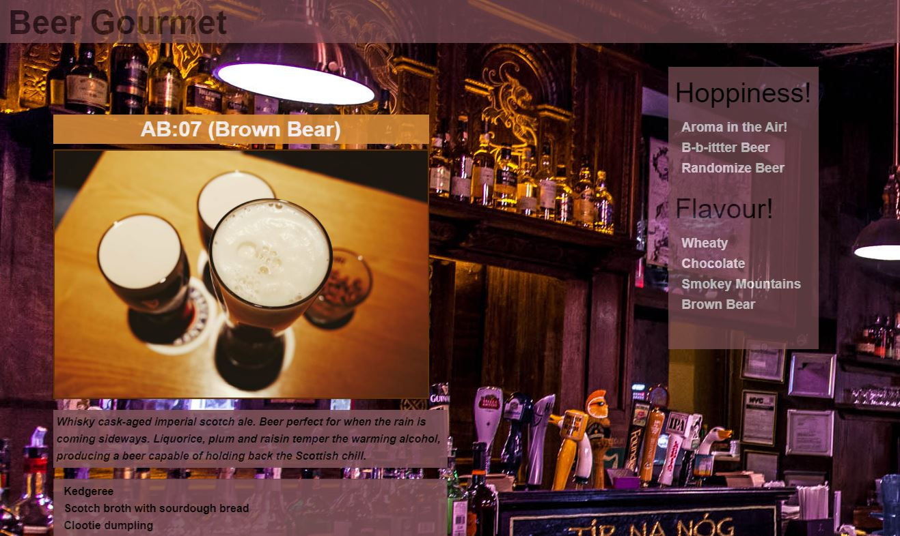

# Beer Gourmet API
### (07 Group Project 1)

## Beer-Gourmet


```
Thirsty and hungry? Look no further than this site to select any beer with a side!  
Search for your favorite beers from a selection of malts, hops or flavors. Hungry, no problem.  
A food-side is provided including the resturant venue.  
```

---
## Some of the Requirements Before you Drink

### API
The Beer-Gourmet utilize 2 APIs that provides beer selections and resturant venues.  
[Punk API](https://api.punkapi.com/) provides a list of beer groupings and [Spoonacular](https://api.spoonacular.com/) allows us to search for almost any food sides.  There is a limit of a 150 requests per day with the Spoonacular API.

### Framework
The application framework for this site is by [Foundation](https://get.foundation/index.html)

### Font Support
Font Awesome


## Application Direct Link 

[Beer-Gourmet](https://jenryval.github.io/Beer-Gourmet/)

## Repository

[GitHub](https://github.com/jenryval/Beer-Gourmet)

---

## Contributors

Thanks to the following people who have contributed to this project:

* [@kimheuer](https://github.com/bootcampdev) Kimberley Heuer Backend developer
* [@jenryval](https://github.com/jenryval) Jenry Valdes Frontend developer
* [@tracygolden](https://github.com/tracy80s2003) Tracy Golden Backend developer
* [@nicholasluberda](https://github.com/) Nicholas Luberda 